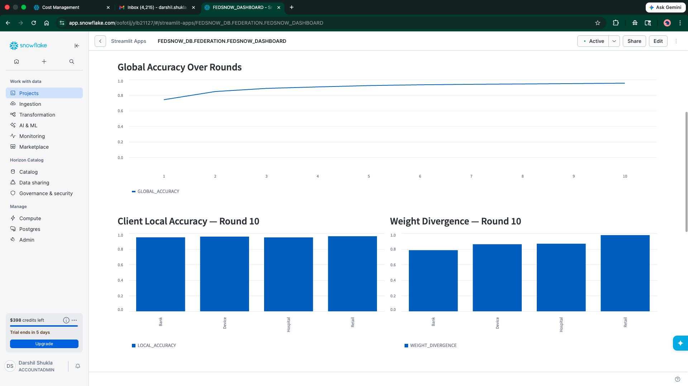
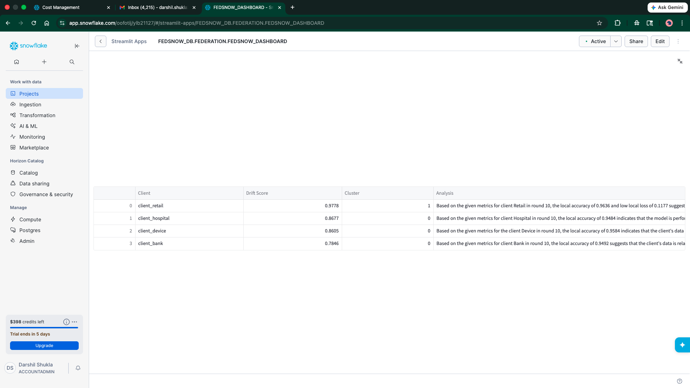
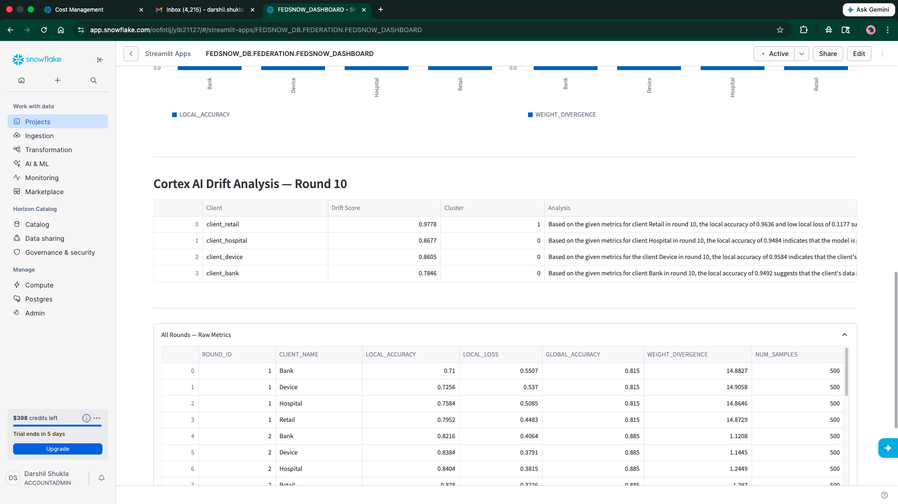
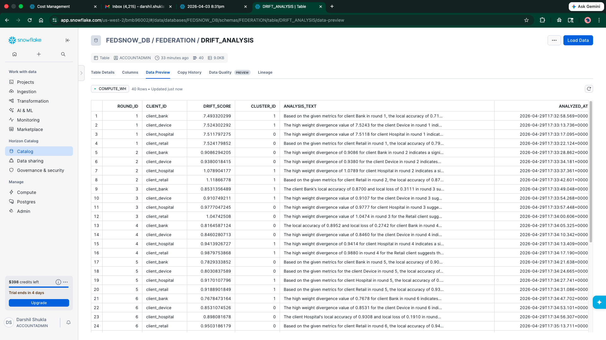
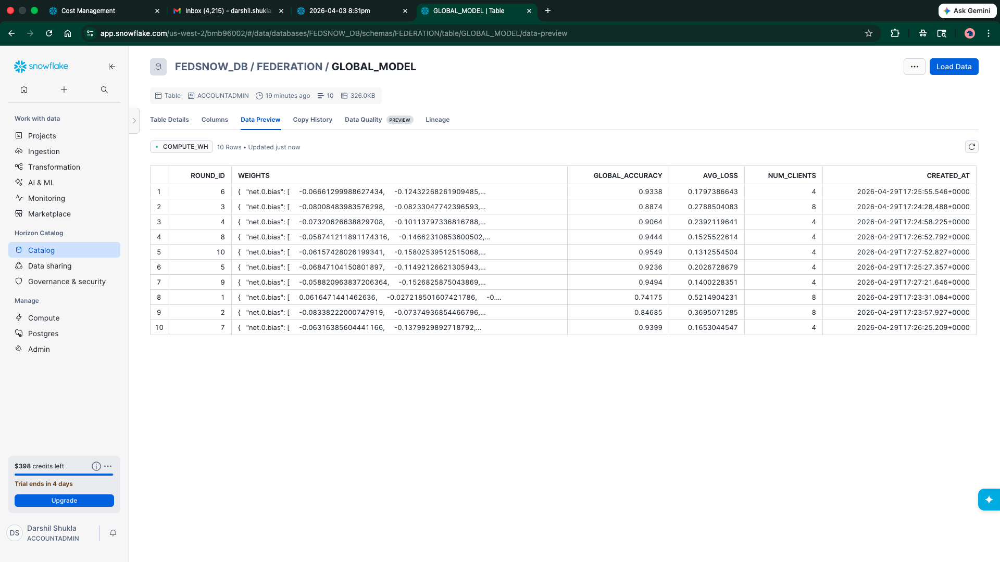

# ❄️ FedSnow — Federated Learning Simulator on Snowflake


FedSnow is a privacy-preserving machine learning simulator that demonstrates Federated Averaging (FedAvg) across four heterogeneous clients — Hospital, Bank, Device, and Retail — where each client trains a PyTorch model on its own private data shard and uploads only the model weights to Snowflake. A Snowpark Python stored procedure performs the secure aggregation, Cortex AI analyzes per-client model drift, and Streamlit in Snowflake visualizes convergence in real time. Raw data never leaves the client.

---

## Architecture

```
┌──────────────────────────────────────────────────────────────────────┐
│                         LOCAL CLIENTS                                │
│                                                                      │
│  ┌────────────┐  ┌────────────┐  ┌────────────┐  ┌────────────┐    │
│  │  Hospital  │  │    Bank    │  │   Device   │  │   Retail   │    │
│  │ 70% cls 0  │  │ 60% cls 1  │  │  50/50     │  │ 80% cls 1  │    │
│  │  PyTorch   │  │  PyTorch   │  │  PyTorch   │  │  PyTorch   │    │
│  └─────┬──────┘  └─────┬──────┘  └─────┬──────┘  └─────┬──────┘    │
│        │ weights only  │               │               │            │
└────────┼───────────────┼───────────────┼───────────────┼────────────┘
         │               │               │               │
         ▼               ▼               ▼               ▼
┌──────────────────────────────────────────────────────────────────────┐
│                    SNOWFLAKE (Aggregation Server)                    │
│                                                                      │
│  CLIENT_WEIGHTS  ──►  FEDAVG_AGGREGATE (Snowpark SP)                │
│                              │                                       │
│                              ▼                                       │
│                        GLOBAL_MODEL                                  │
│                              │                                       │
│                    ┌─────────┴──────────┐                           │
│                    ▼                    ▼                            │
│             ROUND_METRICS        DRIFT_ANALYSIS                     │
│                                  (Cortex AI)                        │
│                                                                      │
│  ┌────────────────────────────────────────────┐                     │
│  │        Streamlit in Snowflake Dashboard     │                     │
│  └────────────────────────────────────────────┘                     │
└──────────────────────────────────────────────────────────────────────┘
```

---

## Federated Averaging — How It Works

FedAvg is the canonical algorithm for federated learning:

1. **Broadcast** — the server sends the current global model weights to every client.
2. **Local training** — each client runs several epochs of SGD on its own private dataset.
3. **Upload** — only the updated weight tensors (not the data) are sent to the server.
4. **Aggregate** — the server computes a weighted average of all client weights, where each client's contribution is proportional to its dataset size:

   ```
   w_global = Σ (n_i / N) * w_i
   ```

5. **Repeat** — the new global model is broadcast and the cycle continues.

Because gradients (or weights) carry far less information than raw data, federated learning provides strong privacy guarantees while still enabling collaborative model improvement.

---

## Why Snowflake as an Aggregation Server?

Traditional FL aggregation servers are custom-built, single-tenant, and hard to audit. Using Snowflake as the aggregation layer provides:

- **Governance** — every weight upload is a versioned row in a governed table with full lineage.
- **Compute isolation** — `FEDAVG_AGGREGATE` runs as a Snowpark stored procedure inside Snowflake's compute layer; the aggregation logic never touches a client machine.
- **Scalability** — Snowflake's warehouse scales automatically for thousands of clients.
- **Cortex AI** — built-in LLM inference for drift analysis without leaving the platform.
- **Zero-copy sharing** — results can be shared with stakeholders via Snowflake Data Sharing without extracting data.
- **Auditability** — the `GLOBAL_MODEL` and `ROUND_METRICS` tables provide a complete audit trail of every round.

---

## Repository Structure

```
fedsnow/
├── README.md
├── requirements.txt
├── .env.example
├── config.py                        # Snowflake credentials + hyperparameters
├── setup/
│   ├── 01_create_schema.sql         # Database + schema
│   ├── 02_create_tables.sql         # CLIENT_WEIGHTS, GLOBAL_MODEL, etc.
│   └── 03_create_stage.sql          # Internal stage for weight files
├── clients/
│   ├── base_client.py               # FedMLP model + train/serialize helpers
│   ├── hospital_client.py           # 70% class 0
│   ├── bank_client.py               # 60% class 1
│   ├── device_client.py             # 50/50 balanced
│   └── retail_client.py             # 80% class 1
├── data/
│   └── generate_shards.py           # Non-IID CSV shards (stay local)
├── snowflake/
│   ├── upload_weights.py            # Insert weights to CLIENT_WEIGHTS
│   ├── fedavg_procedure.py          # Register + call FEDAVG_AGGREGATE SP
│   ├── download_global_model.py     # Fetch global weights → FedMLP
│   └── round_orchestrator.py        # Snowflake Task creation + trigger
├── cortex/
│   └── drift_analysis.py            # L2 divergence + Cortex COMPLETE + k-means
├── streamlit_app/
│   └── app.py                       # Streamlit in Snowflake dashboard
├── federation/
│   └── run_federation.py            # Main federation loop (10 rounds)
└── evaluation/
    └── evaluate_global_model.py     # Accuracy, F1, confusion matrix, comparison
```

---

## Setup

### Prerequisites

- Python 3.11+
- A Snowflake account with `ACCOUNTADMIN` or equivalent privileges
- A virtual environment is strongly recommended

### 1. Install dependencies

```bash
pip install -r requirements.txt
```

### 2. Configure environment

```bash
cp .env.example .env
# Edit .env with your Snowflake credentials
```

### 3. Run SQL setup in Snowflake

Execute the three setup scripts in order (Snowsight worksheet or SnowSQL):

```sql
-- In Snowsight or SnowSQL:
-- Step 1
\i setup/01_create_schema.sql
-- Step 2
\i setup/02_create_tables.sql
-- Step 3
\i setup/03_create_stage.sql
```

### 4. Register the FedAvg stored procedure

```bash
python snowflake/fedavg_procedure.py --register
```

### 5. Generate non-IID data shards

```bash
python data/generate_shards.py
```

This creates `data/shards/` with four client CSVs and a held-out test set. These files stay local and are **never uploaded to Snowflake**.

### 6. Run federation

```bash
# Quick 3-round test
python federation/run_federation.py --rounds 3

# Full 10-round run
python federation/run_federation.py

# Local dry run (no Snowflake connection required)
python federation/run_federation.py --rounds 3 --skip-upload
```

### 7. Evaluate the global model

```bash
# Evaluate latest round
python evaluation/evaluate_global_model.py

# Compare round 1 vs round 10
python evaluation/evaluate_global_model.py --compare
```

### 8. Deploy the Streamlit dashboard

1. In Snowsight, navigate to **Streamlit** → **+ Streamlit App**
2. Paste the contents of `streamlit_app/app.py`
3. Set the database context to `FEDSNOW_DB.FEDERATION`
4. Click **Run**

---

## Results

| Round | Global Accuracy | Avg Loss | Precision | Recall | F1     |
|-------|----------------|----------|-----------|--------|--------|
| 1     | 76.0%          | 0.5215   | 0.8171    | 0.6700 | 0.7363 |
| 3     | 91.0%          | 0.2789   | 0.8942    | 0.9300 | 0.9118 |
| 5     | 94.0%          | 0.2027   | 0.9490    | 0.9300 | 0.9394 |
| 7     | 95.5%          | 0.1653   | 0.9691    | 0.9400 | 0.9543 |
| 10    | **95.5%**      | 0.1313   | 0.9691    | 0.9400 | 0.9543 |

**Total improvement (Round 1 → Round 10): +19.5% accuracy, +21.8% F1**

Evaluated on a held-out 200-sample test set. Raw data never left the clients — only model weights were aggregated via FedAvg in Snowflake.

---

## Screenshots

### Streamlit Dashboard — Global Accuracy Convergence

*Smooth convergence curve from 74% → 95.5% over 10 rounds. The steep early climb (rounds 1→3) shows FedAvg rapidly aligning the 4 non-IID client models.*

### Streamlit Dashboard — Client Accuracy & Weight Divergence (Round 10)

*Left: all 4 clients exceed 94% local accuracy by round 10. Right: Retail has the highest weight divergence (0.978) due to its 80% class-1 skew, while Bank sits lowest (0.785).*

### Cortex AI Drift Analysis — Round 10

*Snowflake Cortex (mistral-7b) analyzing each client's federation behavior. Retail (cluster 1) is flagged for highest drift; Bank, Device, Hospital (cluster 0) are converging well.*

### DRIFT_ANALYSIS Table — All 40 Rows

*40 rows (4 clients × 10 rounds) with Cortex-generated analysis text. Notice drift scores drop sharply from ~7.5 in round 1 to ~0.8–1.1 by round 2 as FedAvg takes effect.*

### GLOBAL_MODEL Table — 10 Rounds of Aggregated Weights

*Each row is a full PyTorch MLP stored as a Snowflake VARIANT. GLOBAL_ACCURACY climbs from 0.742 → 0.955. The WEIGHTS column holds the actual serialized tensors aggregated by the FedAvg stored procedure.*

> **To add screenshots:** save the 5 images to `screenshots/` with the filenames shown above.

---

## Tech Stack

| Component | Technology |
|-----------|-----------|
| Local training | PyTorch 2.0+ MLP |
| Weight serialization | JSON → Snowflake VARIANT |
| Secure aggregation | Snowpark Python Stored Procedure |
| Storage | Snowflake tables + internal stage |
| Orchestration | Snowflake Tasks |
| Drift analysis | Snowflake Cortex COMPLETE (mistral-7b) |
| Clustering | scikit-learn KMeans |
| Dashboard | Streamlit in Snowflake |
| Dataset | sklearn make_classification (non-IID splits) |

---

## Privacy Guarantee

FedSnow implements the core privacy contract of federated learning: **raw data never leaves the client**. The Hospital, Bank, Device, and Retail shards are saved as local CSV files that are never uploaded to any remote system. Only serialized model weight tensors cross the network boundary. The aggregation, analysis, and visualization all operate solely on these weights inside Snowflake's governed environment.
